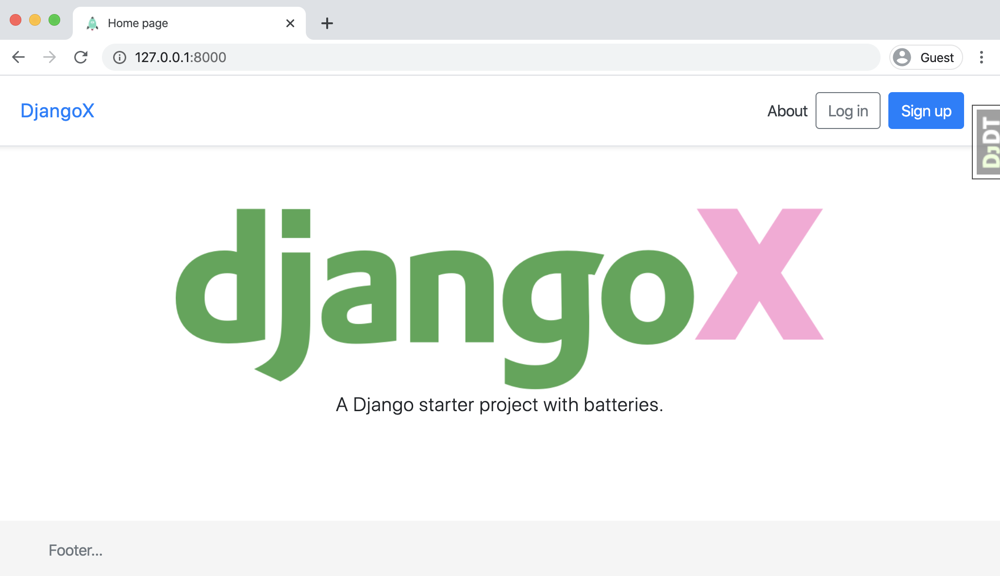

# Lab: 29 - DjangoX

## Overview

It is quite common to set up your Django projects the same way every time.

Some of those common tasks are...

- Create a custom user
- Configure static assets
- Add authentication
- Set up styling
- Install common libraries
- Wire up 3rd party development tools

Repeating these steps over and over violates the DRY (Don't Repeat Yourself) rule. So pro developers usually create a skeleton application they use to start off their projects.

Luckily for us, there's already a great example of such a skeleton - [DjangoX](https://github.com/wsvincent/djangox){:target="\_blank"}

## Feature Tasks and Requirements

- Create a website using DjangoX as a template.
  - Click the `Use this template` button on home page of DjangoX repository.
- Name your repo whatever you like.
- Create a Django app of your choosing.
- The specific functionality of the site is up to you but should have a model that makes use of `get_user_model`

## Implementation Notes

DjangoX does not use poetry out of the box. So you'll need to look at the files DjangoX does use to see which dependencies are used.

- View `Pipfile` and note the [packages] section.
  - Use `poetry add` to install packages listed in Pipfile
  - **NOTE:** Mac BigSur users may need to run extra command in case of installation errors.
    - > export SYSTEM_VERSION_COMPAT=1
- Delete the configuration files that aren't needed anymore since we're using Poetry
  - Pipfile
  - Pipfile.lock
  - Dockerfile
  - docker-compose.yml
  - requirements.txt

&nbsp;

**PR Link**: <https://github.com/YAHIAQOUS/djangox-template/pull/1>

&nbsp;

&nbsp;

&nbsp;

> A batteries-included Django starter project. For a production-ready version see the book [Django for Professionals](https://djangoforprofessionals.com).

## 🚀 Features

- Django 3.1 & Python 3.8
- Install via [Pip](https://pypi.org/project/pip/), [Pipenv](https://pypi.org/project/pipenv/), or [Docker](https://www.docker.com/)
- User log in/out, sign up, password reset via [django-allauth](https://github.com/pennersr/django-allauth)
- Static files configured with [Whitenoise](http://whitenoise.evans.io/en/stable/index.html)
- Styling with [Bootstrap v4](https://github.com/twbs/bootstrap)
- Debugging with [django-debug-toolbar](https://github.com/jazzband/django-debug-toolbar)
- DRY forms with [django-crispy-forms](https://github.com/django-crispy-forms/django-crispy-forms)

## 

## Table of Contents

- **[Installation](#installation)**
  - [Pip](#pip)
  - [Pipenv](#pipenv)
  - [Docker](#docker)
- [Setup](#setup)
- [Contributing](#contributing)
- [Support](#support)
- [License](#license)

---

## 📖 Installation

DjangoX can be installed via Pip, Pipenv, or Docker depending upon your setup. To start, clone the repo to your local computer and change into the proper directory.

```
$ git clone https://github.com/wsvincent/djangox.git
$ cd djangox
```

### Pip

```
$ python3 -m venv djangox
$ source djangox/bin/activate
(djangox) $ pip install -r requirements.txt
(djangox) $ python manage.py migrate
(djangox) $ python manage.py createsuperuser
(djangox) $ python manage.py runserver
# Load the site at http://127.0.0.1:8000
```

### Pipenv

```
$ pipenv install
$ pipenv shell
(djangox) $ python manage.py migrate
(djangox) $ python manage.py createsuperuser
(djangox) $ python manage.py runserver
# Load the site at http://127.0.0.1:8000
```

### Docker

```
$ docker build .
$ docker-compose up -d
$ docker-compose exec web python manage.py migrate
$ docker-compose exec web python manage.py createsuperuser
# Load the site at http://127.0.0.1:8000
```

For Docker, the `INTERNAL_IPS` configuration in `config/settings.py` must be updated to the following:

```python
# config/settings.py
# django-debug-toolbar
import socket
hostname, _, ips = socket.gethostbyname_ex(socket.gethostname())
INTERNAL_IPS = [ip[:-1] + "1" for ip in ips]
```

## Setup

```
# Run Migrations
(djangox) $ python manage.py migrate

# Create a Superuser
(djangox) $ python manage.py createsuperuser

# Confirm everything is working:
(djangox) $ python manage.py runserver

# Load the site at http://127.0.0.1:8000
```

---

## 🤝 Contributing

Contributions, issues and feature requests are welcome! See [CONTRIBUTING.md](https://github.com/wsvincent/djangox/blob/master/CONTRIBUTING.md).

## ⭐️ Support

Give a ⭐️ if this project helped you!

## License

[The MIT License](LICENSE)

<!-- ## Docker Usage
```
# Build the Docker Image
$ docker-compose build

# Run Migrations
$ docker-compose run --rm web python manage.py migrate

# Create a Superuser
$ docker-compose run --rm web python manage.py createsuperuser

# Run Django on http://localhost:8000/
$ docker-compose up

# Run Django in background mode
$ docker-compose up -d

# Stop all running containers
$ docker-compose down

# Run Tests
$ docker-compose run --rm web pytest

# Re-build PIP requirements
$ docker-compose run --rm web pip-compile requirements/requirements.in
```-->

<!-- ## Next Steps

- Use [PostgreSQL locally via Docker](https://wsvincent.com/django-docker-postgresql/)
- Use [django-environ](https://github.com/joke2k/django-environ) for environment variables
- Update [EMAIL_BACKEND](https://docs.djangoproject.com/en/3.0/topics/email/#module-django.core.mail) to configure an SMTP backend
- Make the [admin more secure](https://opensource.com/article/18/1/10-tips-making-django-admin-more-secure)

## Adding Social Authentication

- [Configuring Google](https://wsvincent.com/django-allauth-tutorial-custom-user-model/#google-credentials)
- [Configuring Facebook](http://www.sarahhagstrom.com/2013/09/the-missing-django-allauth-tutorial/#Create_and_configure_a_Facebook_app)
- [Configuring Github](https://wsvincent.com/django-allauth-tutorial/)
- `django-allauth` supports [many, many other providers in the official docs](https://django-allauth.readthedocs.io/en/latest/providers.html) -->
